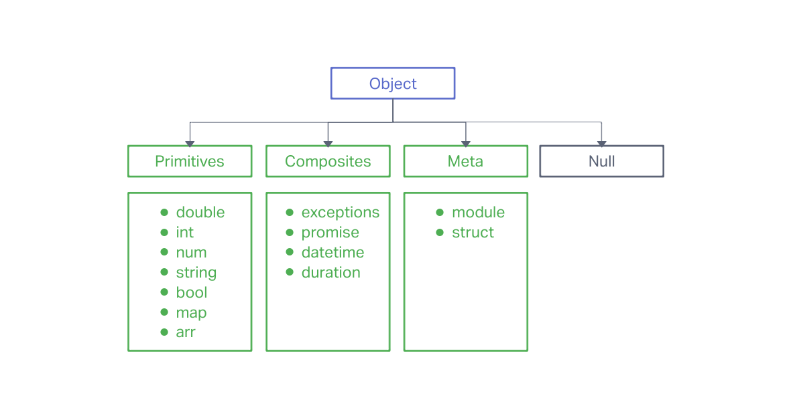

# Mochaccino Language

Mochaccino makes development pleasant.

# Features

## Factories
A factory in Mochaccino lets you run code from other programming languages natively within Mochaccino:
```
package main;
factory dart;

main()<void> {
    Console.log("Mochaccino!"); // A Mochaccino function
    print("Dart!"); // A Dart function
}
```

## Debugging Tools
An extensive suite of powerful debugging tools such as Timeline and Toolbox provide an insight to how every line of your code behaves.

## Modularity and Organisation
A powerful project manager, Barista, helps manage the administrative tasks such as package installing, static analysis, documentation injection, etc.

## Modules
On the note of modularity, Mochaccino has a `module` keyword.

## Structs

## Context Flags
A handwritten LL(2) parser offers a few advantages, one of which is full control over the compilation process. This means that tokens produced by the `Tokeniser` can have context attached to them, and this context can be passed to the `Interpreter`.

## Documentation Injection
Ever seen code snippets like the one below?
```
```
While, yes, they do help VSCode show richer information about the code in question, sometimes they get a little excessive, and you start to lose the big picture ("Wait, which class am I looking at again?").

To get around this, Mochaccino has a special feature called Documentation Injection. In a separate `docs` directory, you write all the documentation for your code, and in the source files, you provide links to the specific section of the documentation that explains the code. Take a look:
```
...
/// A type of coffee [core/types/mochaccino]
struct mochaccino extends coffee {
    ...
}
...
```

# Mochaccino Type System
Mochaccino's unified type system is pretty straightforward.

Primitives and composites are first-class citizens, but meta objects are not. Variables in Mochaccino can be assigned to structs and modules, but will only act as aliases, and there is no lambda notation to create meta objects inline.

You might want to use a variable to alias a struct for whatever reasons. However, the `runtimeType` of the object __will always return the original struct__.
```swift
struct Coffee {}
...
var x<STRUCT> = Coffee;
var data = {}::x;
Console.log(data.runtimeType); // Coffee
```
Further, variables assigned to `STRUCT` objects can be used as type literals.
```swift
struct Coffee {}
...
var x<STRUCT> = Coffee;
var data2<x> = {}::x;
```